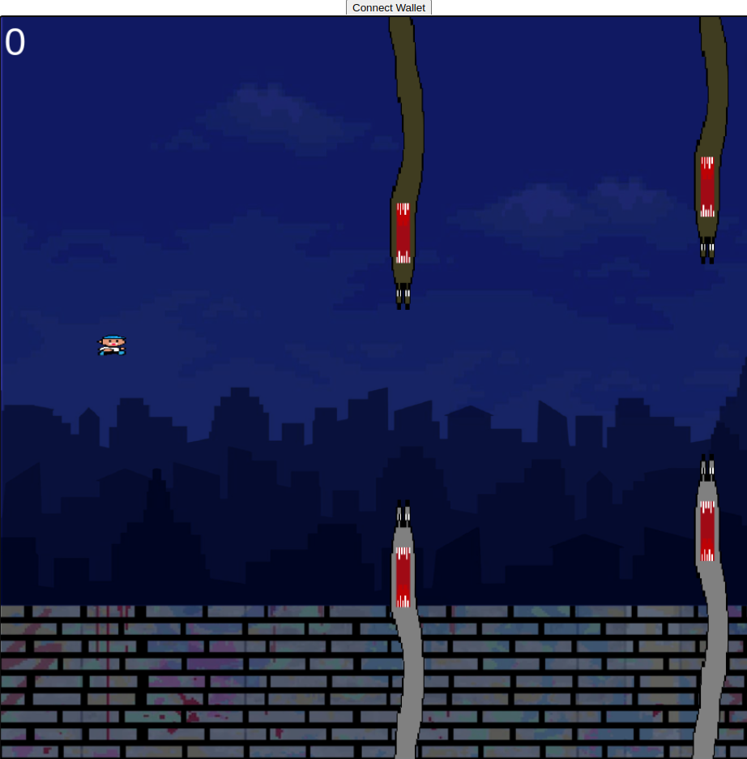
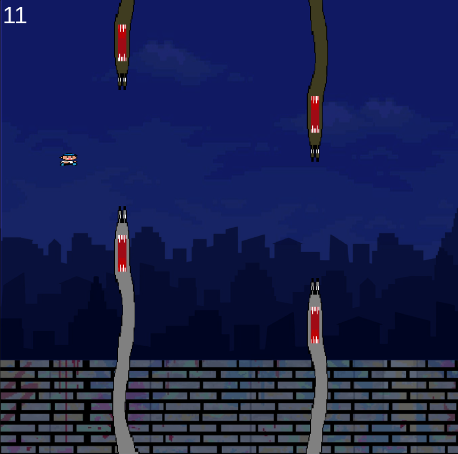
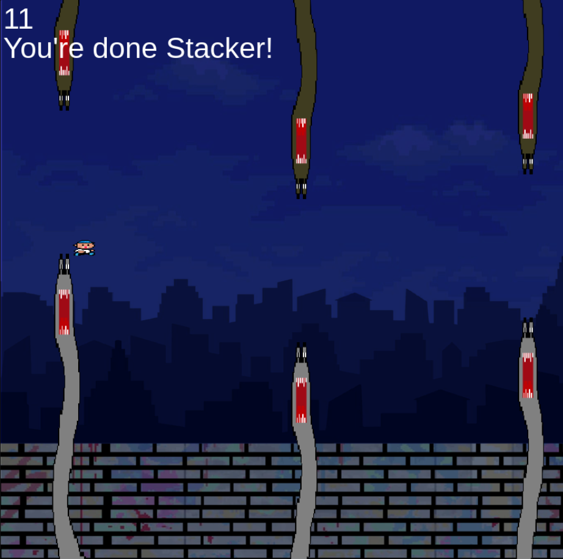

# Stacker Pixel Jumper

Stacker Pixel Jumper is a simple and addictive browser-based game where players control stacker (the game's main character) to avoid obstacles and score points that could eventually award you entries to a lottery on the Stacks Network (in development).

- [Demo](#demo)
- [Features](#features)
- [How to Play](#how-to-play)
- [Controls](#controls)
- [Installation](#installation)
- [Game Screenshots](#game-screenshots)

## Demo

https://web4swap.com

## Features

- Endless gameplay.
- Responsive design for both desktop and mobile devices.
- Score tracking and obstacle avoidance mechanics.
- Sound effects for an immersive experience.

## How to Play

The goal of the game is to navigate the stacker through obstacles and earn points by passing through the gap between obstacles. The game ends if stacker collides with any monster.

## Controls

- **Space Bar / Arrow Up / Key X**: Jump (Desktop)
- **Tap on Screen**: Jump (Mobile)

## Installation

1. Clone repository:

   ```bash
   git clone https://github.com/your-username/stacker-pixel-jumper.git


## Game Screenshots
   
   
   